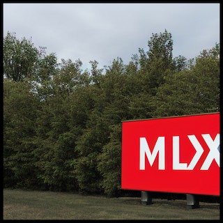
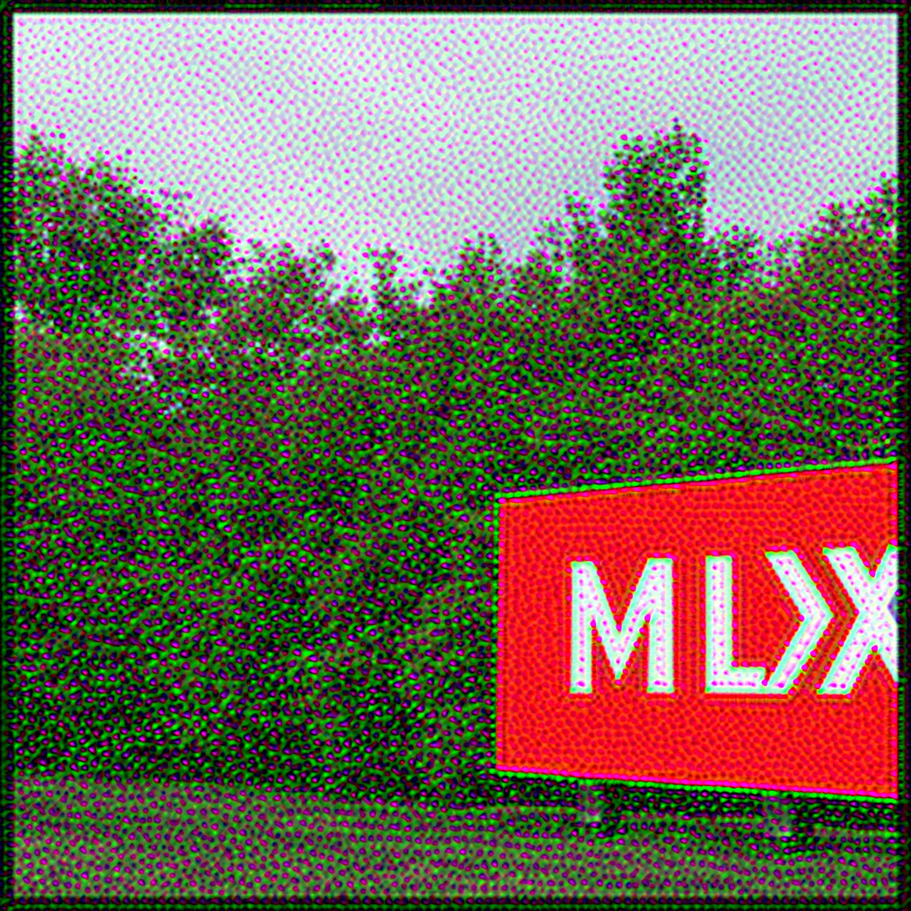
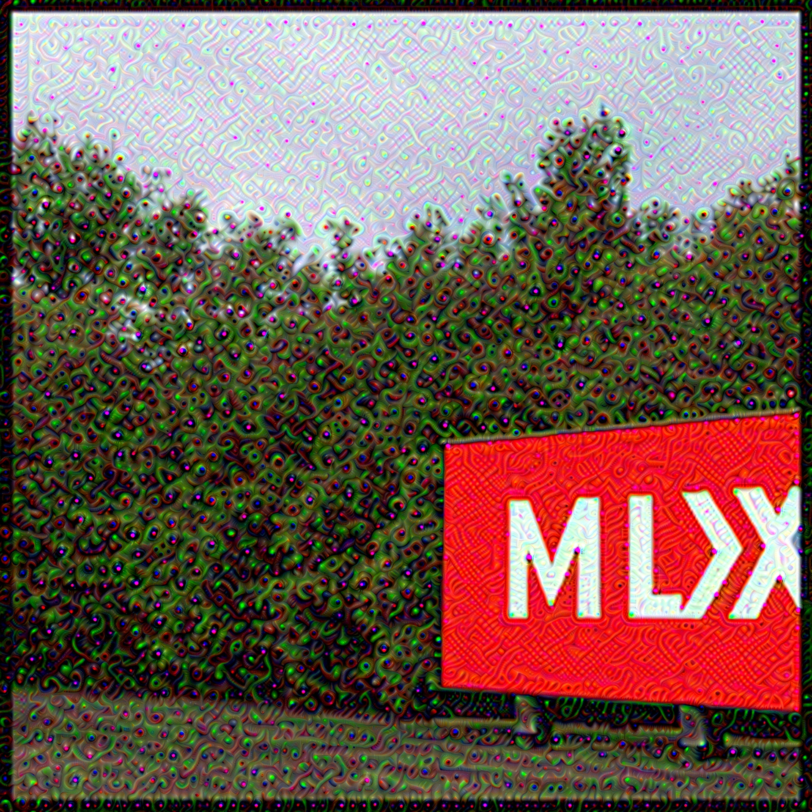
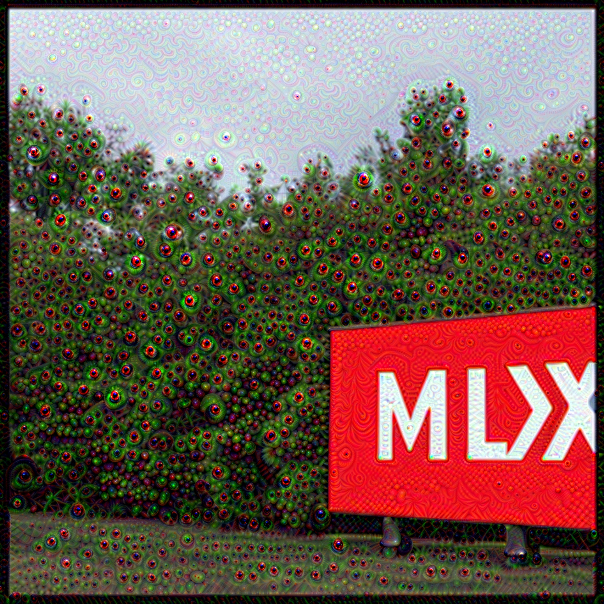

# mlx-deepdream
A MLX port of [pytorch-deepdream](https://github.com/gordicaleksa/pytorch-deepdream), implementing Google's DeepDream (Mordvintsev et al.). 
For technical details of how DeepDream works, see the [wikipedia page](https://en.wikipedia.org/wiki/DeepDream).

This port supports most of the functionality offered by the pytorch implementation such as video-mode, ouroboros-mode and more. See below for a list of accepted arguments.

<div style="display: flex; justify-content: space-between;">
    
    
    
    
</div>

```
usage: main.py [-h] [--input INPUT] [--img_width IMG_WIDTH] [--layers_to_use LAYERS_TO_USE [LAYERS_TO_USE ...]] [--model_name {VGG19,ALEXNET,RESNET50}] [--pyramid_size PYRAMID_SIZE]
               [--pyramid_ratio PYRAMID_RATIO] [--num_gradient_ascent_iterations NUM_GRADIENT_ASCENT_ITERATIONS] [--lr LR] [--create_ouroboros] [--ouroboros_length OUROBOROS_LENGTH]
               [--fps FPS] [--frame_transform {ZOOM,ZOOM_ROTATE,TRANSLATE}] [--blend BLEND] [--should_display] [--spatial_shift_size SPATIAL_SHIFT_SIZE]
               [--smoothing_coefficient SMOOTHING_COEFFICIENT] [--use_noise]

options:
  -h, --help            show this help message and exit
  --input INPUT         Input IMAGE or VIDEO name that will be used for dreaming
  --img_width IMG_WIDTH
                        Resize input image to this width
  --layers_to_use LAYERS_TO_USE [LAYERS_TO_USE ...]
                        Layer whose activations we should maximize while dreaming
  --model_name {VGG19,ALEXNET,RESNET50}
                        Neural network (model) to use for dreaming
  --pyramid_size PYRAMID_SIZE
                        Number of images in an image pyramid
  --pyramid_ratio PYRAMID_RATIO
                        Ratio of image sizes in the pyramid
  --num_gradient_ascent_iterations NUM_GRADIENT_ASCENT_ITERATIONS
                        Number of gradient ascent iterations
  --lr LR               Learning rate i.e. step size in gradient ascent
  --create_ouroboros    Create Ouroboros video (default False)
  --ouroboros_length OUROBOROS_LENGTH
                        Number of video frames in ouroboros video
  --fps FPS             Number of frames per second
  --frame_transform {ZOOM,ZOOM_ROTATE,TRANSLATE}
                        Transform used to transform the output frame and feed it back to the network input
  --blend BLEND         Blend coefficient for video creation
  --should_display      Display intermediate dreaming results (default False)
  --spatial_shift_size SPATIAL_SHIFT_SIZE
                        Number of pixels to randomly shift image before grad ascent
  --smoothing_coefficient SMOOTHING_COEFFICIENT
                        Directly controls standard deviation for gradient smoothing
  --use_noise           Use noise as a starting point instead of input image (default False)
```

# WIP
Currently there are a few issues with this port. 
First of all, a complete run of the algorithm is a bit slower than the pytorch version running on mps. The major bottleneck causing this issue is the `mlx_output_adapter()` function. The function easily takes up 90% of the computation time.  I am looking for a solution to solve this.

Another issue is caused by the same function. On my 32GB M2 Pro, the standard VGG19 model works perfectly fine (albeit not as fast as desired). Any other supported model such as AlexNet or ResNet however crashes due to a `std::runtime_error` where too many bytes are trying to be allocated than is possible. Perhaps this issue is caused by me not fully understanding MLX, but it is an issue either way. For this too, I will be trying to find a solution throughout my free time.
